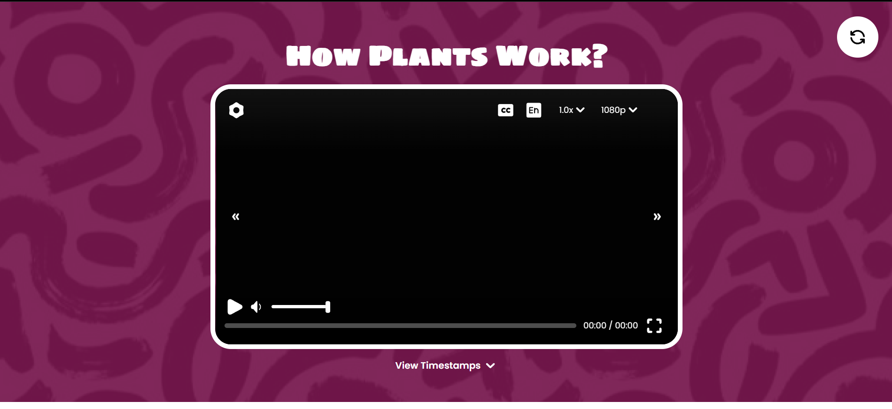
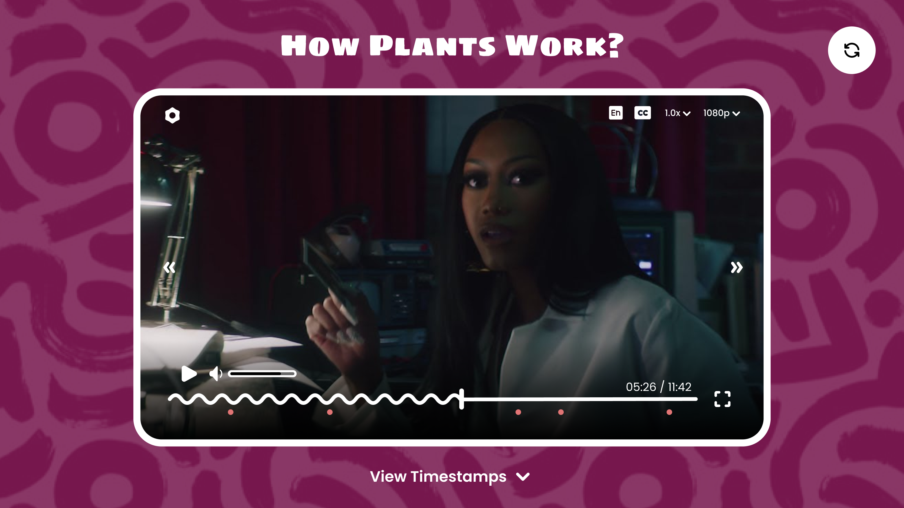

# 🎬 Video Player

A sleek and responsive web-based video player built using HTML, CSS, and JavaScript. This project showcases a custom-designed user interface, offering an intuitive and seamless video playback experience directly in your browser.

Preview: <a href="https://raj-jaiswal.github.io/Video-Player/">https://raj-jaiswal.github.io/Video-Player/</a>



## 🌟 Features

- **Custom UI Controls**: Play, pause, seek, and volume adjustments with interactive buttons and sliders.
- **Responsive Design**: Ensures optimal viewing across desktops.
- **Keyboard Shortcuts**: Enhance user experience with intuitive keyboard controls.
- **Fullscreen Mode**: Toggle fullscreen for an immersive viewing experience.
- **Progress Indicator**: Visual representation of video playback progress.
- **Volume Control**: Easily adjust the volume to your preference.

## 🚀 Getting Started

### Prerequisites

To run this project locally, ensure you have the following:

- A modern web browser (e.g., Chrome, Firefox, Edge, Safari)

### Installation

1. **Clone the Repository**

   ```bash
   git clone https://github.com/raj-jaiswal/Video-Player.git
2. Navigate to the Project Directory
3. cd Video-Player
4. Open index.html in Your Browser

You can open the file directly or use a local development server for enhanced experience.

Directly:
Locate the index.html file in the project directory and open it with your preferred web browser.

Using Live Server (Optional):
If you have the Live Server extension installed in VS Code:
Open the project folder in VS Code.
Right-click on index.html and select "Open with Live Server".

## 🖼️ UI Overview
Proposed UI: 



The video player features a minimalist and user-friendly interface:

Play/Pause Button: Toggle video playback.

Progress Bar: Visualize and navigate through the video timeline.

Volume Slider: Adjust the audio level.

Fullscreen Toggle: Enter or exit fullscreen mode.

Responsive Layout: Adapts seamlessly to various screen sizes.

### Missing Elements
1. Wave Animation in Progress Bar
2. Timestamp Indicators in Timeline

## 🛠️ Technologies Used
HTML5: Markup structure

CSS3: Styling and responsive design

JavaScript: Interactivity and functionality

## 📁 Project Structure
Video-Player<br />
├── assets<br />
│   └── [media files, images]<br />
├── index.html<br />
├── style.css<br />
└── script.js<br />
index.html: Main HTML file containing the video player structure.

style.css: Stylesheet for layout and design.

script.js: JavaScript file handling player functionality.

assets: Directory for media assets like videos and images.

## 📄 License
This project is licensed under the MIT License.

## 🙌 Acknowledgements
Developed by Raj Jaiswal, a passionate developer with interests in 3D modeling, Python, JavaScript, React, and game development.

Feel free to contribute or suggest improvements!
